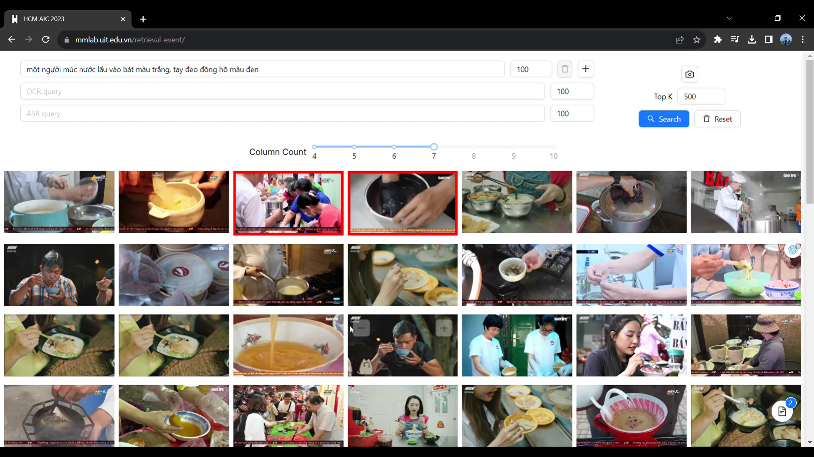

# Retrieval Event

## Requirements

```bash
Docker 
Docker Compose 
```

## Prepare data
All code prepare data in folder ```data_preparation```: 

    - ocr data: ocr_api.py
    - asr data:  asr_prep.py -> whisper_inference.py
    - data for faiss_service: stack_data.py
    - compress image: compress_img.py

The directory ```data/Keyframe``` should look like this (you should compress image to fast render in front-end)
```text
data
|__ Keyframe
|     |__ L01_V001 
|     |       |__ 00000.jpg
|     |       |__ 00001.jpg
|     |       |__ 00002.jpg
|     |       |__ ...
|     |__ L01_V002
|     |       |__ 00000.jpg
|     |       |__ 00001.jpg
|     |       |__ 00002.jpg
|     |       |__ ...
```

The directory ```faiss/data/faiss_database``` should look like this
```text
data
|__ faiss_database
     |__ ViT_B32 
            |__ feature.npy
            |__ keyframe_name.json

```

After deploy, go to meilisearch folder and run below script to add data ocr and asr to meilisearch service: 
```
python src/script.py
```


## Deploy
Config port in ```.env```

```bash
make up_services 
```



